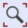

::: {rst-class} break
:::

# Lesson 2: Defining Segments and Displaying Objects

:::{note} Here's an AnyScript file to start with if you have not completed the
previous lesson: {download}`demo.lesson2.any <Downloads/demo.lesson2.any>` 
:::

The basic building blocks of a mechanical system are the "segments" [^f1]. In
AnyBody, segments are treated as rigid elements representing human bones as well
as non-human components such as exoskeleton/machine parts, etc.

**A segment is just a coordinate system with mass and inertial properties, which can move around freely in 3D space.**

(class-inserter)=

## Creating a segment (using the Class Inserter)

We shall start by defining a folder for the segments. Please add the following
text to your model (new text marked in red):


```{literalinclude} Snippets/lesson2/snip.NewModel.main-1.any
:language: AnyScriptDoc
:start-after: //# BEGIN SNIPPET 1
:end-before: //# END SNIPPET 1
```

Load the model by clicking the  icon
or the F7 key. If you expand the "ArmModel" folder in the tree view, you should
see a new, empty folder named "Segs".

We are now ready to add a segment to the model, and this would probably be a
good time to introduce you to the Class Inserter.

```{image} _static/lesson2/image2.png
:alt: Class Inserter
:class: bg-primary
:align: center
```

**The Classes tab on the right edge of your AnyBody
interface opens a Class List containing all the predefined classes in AnyScript.**

**👉 Now** To insert a segment, start by placing your text cursor within the
braces of the newly defined `AnyFolder Segs`. Then find the class `AnySeg` in
the Class List and double-click it to insert its template into your text editor.

You should get this:

```{literalinclude} Snippets/lesson2/snip.NewModel.main-2.any
:language: AnyScriptDoc
:start-after: //# BEGIN SNIPPET 1
:end-before: //# END SNIPPET 1
```

Every object in AnyBody defined by some properties that are both mandatory (the
template contains some default values) or optional (these properties are
commented out). You can delete all optional properties except for `r0` and
`Axes0`.

For an `AnySeg` object `Mass` (segment mass) and `Jii` (diagonal elements of the
inertia tensor) are the mandatory properties. Note that by default, the
segment's coordinate system is located at the center of mass, with its local
coordinate system being the principal axes of inertia.

You can however change this by editing the properties `sCoM` and `Jij`. Go to
"Help->Anyscript Reference" for more information on the `AnySeg` class's
properties.

Let us rename the segment as "UpperArm" and set its {literal}`Mass = 2` and
{literal}`Jii = {0.001, 0.01, 0.01}`:

```{literalinclude} Snippets/lesson2/snip.NewModel.main-3.any
:language: AnyScriptDoc
:start-after: //# BEGIN SNIPPET 1
:end-before: //# END SNIPPET 1
```

Load the model again and notice the warnings you get. Amongst other messages:

*Model Warning: Study 'Main.ArmStudy' contains too few kinematic constraints to
be kinematically determinate.*

**This means that your model has some degrees of freedom, for which AnyBody does
not have any motion or constraint information. It therefore cannot evaluate the
model's kinematics.** We will take care of this in the next lesson

## Displaying a segment

To make something visible in AnyBody, you have two options - you can set the
`Visible` property of the segment to `On`, or you can add a new drawing object
which defines visibility of the segment.

The first option is done by adding the following lines to the segment:

```{literalinclude} Snippets/lesson2/snip.NewModel.main-4.any
:language: AnyScriptDoc
:start-after: //# BEGIN SNIPPET 1
:end-before: //# END SNIPPET 1
```

Here, the visibility of the *reference frame*, the *nodes*, and the *ellipsoid* — whose
dimensions graphically represent the segment's inertia, `Jii` — are all set to be visible.
Changing any component of `Jii` will alter the shape of the ellipsoid.
Reload the model, and look at the Model View (you might have to press
the  
button to locate your segment).

The second option is to add a new drawing object of class `AnyDrawSeg` to the
segment, which defines visibility of the segment.

```AnyScriptDoc
AnySeg UpperArm = {
  //r0 = {0.0, 0.0, 0.0};
  //Axes0 = {{1.0, 0.0, 0.0}, {0.0, 1.0, 0.0}, {0.0, 0.0, 1.0}};
  Mass = 2;
  Jii = {0.001, 0.01, 0.01};
  §AnyDrawSeg drw = {};§
}; //UpperArm
```

You can try both options and see the same result. For the rest of this tutorial,
we will use the first option of setting the `Visible` properties to `On`. But
you might see the second option in other tutorials and models.

## Adding point nodes to a segment

We define some nodes in the local coordinate system of the segment, for
eventually attaching muscles, joints, forces etc. to the segment.

Figuring out these node locations for the actual human models can be a laborious
task, but you can often use ready-made anatomical nodes defined in most AMMR
models.

For this model, copy and paste the following lines into your file:

```{literalinclude} Snippets/lesson2/snip.NewModel.main-5.any
:language: AnyScriptDoc
:start-after: //# BEGIN SNIPPET 1
:end-before: //# END SNIPPET 1
```

If you reload the model, you should see the newly added nodes connected to the
center of gravity by yellow pins.

```{image} _static/lesson2/image4.png
:alt: Upper arm with nodes
:class: bg-primary
:align: center
:width: 70%
```

## Creating a second segment

You will now add a forearm segment to the mechanism by copy-pasting these lines
into the `Segs` folder:

```{literalinclude} Snippets/lesson2/snip.NewModel.main-6.any
:language: AnyScriptDoc
:start-after: //# BEGIN SNIPPET 1
:end-before: //# END SNIPPET 1
```

**When you reload the model, you may not see the forearm immediately because
it's defined to look exactly the same and is loaded exactly on top of the upper
arm.**

To solve this problem, you can change the initial/load time position of the two
segments by adjusting `r0` (translation w.r.t global frame at load-time) and `Axes0`
(rotation matrix w.r.t global frame at load-time).

Remember that your simulation, will only use these load-time positions as an
initial guess, on the way to enforcing specified motions and constraints (such
as joints between segments). More on this in the next lesson.

For now, let us first change `r0` - the global position of the segment at load-time.

```{literalinclude} Snippets/lesson2/snip.NewModel.main-7.any
:language: AnyScriptDoc
:start-after: //# BEGIN SNIPPET 1
:end-before: //# END SNIPPET 1
```

and

```{literalinclude} Snippets/lesson2/snip.NewModel.main-7.any
:language: AnyScriptDoc
:start-after: //# BEGIN SNIPPET 2
:end-before: //# END SNIPPET 2
```

This will clearly separate the segments in your Model View:

```{image} _static/lesson2/image5.png
:alt: Upper and lower arm
:align: center
:width: 60%
```

## Rotation matrices in AnyBody

To improve the visual impression of the arm segments at load time, we will set
the `Axes0` property, which is really a rotation matrix.

Your UpperArm segment currently looks like this:

```{literalinclude} Snippets/lesson2/snip.NewModel.main-8.any
:language: AnyScriptDoc
:start-after: //# BEGIN SNIPPET 1
:end-before: //# END SNIPPET 1
```

:::{note}
Note that matrices in AnyBody are arranged row-wise, so {1, 0, 0} in `Axes0` is the
first row of a 3x3 matrix.
:::

Rotation matrices are a bit difficult to cook up on the fly. If your spatial
thinking is good, you could maybe figure out the exact expressions for all 9
components of the 3x3 Axes0 matrix.

An easier solution is to use a standard function named `RotMat`, which returns
a **rotation matrix** corresponding to a given axis and rotation angle. Therefore,
we can specify:

```{literalinclude} Snippets/lesson2/snip.NewModel.main-9.any
:language: AnyScriptDoc
:start-after: //# BEGIN SNIPPET 1
:end-before: //# END SNIPPET 1
```

When you reload again, you will see that the UpperArm rotated -90 degrees about
the global z axis, as the function arguments indicate. The `RotMat` functions
needs rotations as radians, hence the multiplication of the 90 degree angle by
pi/180. AnyBody identifies the word "pi" as 3.14159.

:::{note}
Angles in AnyBody are always in radians.
:::

In the next lesson, we will look at how joints can be used to constrain the
movement of segments and allow them to articulate the way we desire.


```{rubric} Footnotes
```

[^f1]: In rigid body dynamics terminology, a "segment" would be called a "rigid
    body", but to avoid unnecessary confusion between the rigid bodies and the
    total body model, we have chosen to use "segments" for the rigid parts of
    the model.
