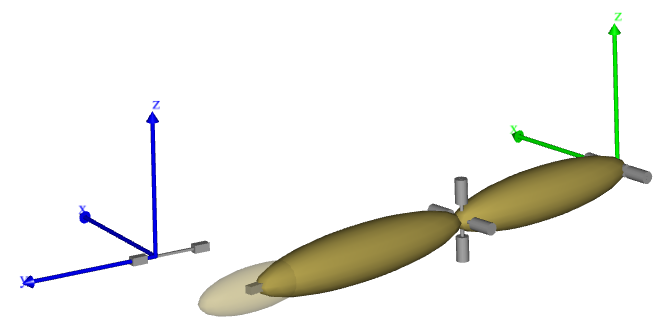

# Lesson 3: Kinematic Analysis

The `Kinematics` operation can be explained in two ways: a brief overview and a
detailed deep dive. The brief overview is that it enables your model to execute
the movements you've defined using drivers, focusing solely on the movement
without involving any force calculations. Even if the system isn't perfectly
balanced, it can still undergo the `Kinematics` operation. However, the model
must be kinematically determinate, a concept we'll explore in the detailed
explanation.

So, get ready, and let's dive deeper into...

::::{dropdown} The long explanation -- *tl;dr*
:open:

:::{note}
:class: margin 
The physics term "rigid body" is called a "segment" in
AnyBody to avoid confusion with the layman/physiological term for "body". 
::: 

An AnyBody model is essentially a collection of rigid segments, which you can
visualize as potatoes floating in space. In the context of AnyBody, we refer to
these "rigid bodies" as "segments".

Each segment can move in six different directions, or degrees of freedom: three
movements along the coordinate axes and three rotations about the same axes. If
we have $n$ segments in the model, the model will have a total of $6n$ degrees
of freedom, unless some are constrained. The goal of kinematic analysis is to
determine the position of all segments at all times, which requires $6n$ pieces
of information, or equations, to resolve the $6n$ degrees of freedom.

One common way to constrain degrees of freedom (or add equations) is to add
joints to the model. When two segments are joined, they lose some of their
freedom to move independently. For example, two segments joined at their ends by
a ball-and-socket joint are constrained such that the $x$, $y$, and $z$
coordinates of the joined points must be the same, adding three constraints or
equations to the system.

If you add enough joints to provide all $6n$ constraints, it might be
mathematically possible to solve the equations and find the position of all the
segments. However, the result would be static, as the system would not be able
to move. Typically, a body model will have enough joints to keep the segments
together but few enough to allow the model to move. The remaining constraints or
equations come from the drivers. After the joints have consumed their share of
the degrees of freedom, enough drivers must be added to resolve the remaining
unknowns in the system up to the required number of $6n$. During the Kinematics
operation, these drivers are taken through their sequences of values, and the
positions of all the segments are resolved for each time step by solving the
$6n$ equations.

A model is said to be kinematically determinate when it has $6n$ equations that
can be solved. This is usually necessary for the kinematic analysis. However,
there are exceptions where the system can be solved even when the number of
equations differs from $6n$, or when the system cannot be solved even though
there are $6n$ equations available. Both cases involve redundant constraints.

Redundant constraints are those that constrain the same degrees of freedom in
the same way. For example, if you accidentally define a joint twice, the
equations provided by those two joints will be redundant. They will appear when
you count constraints, but they won't have much effect.

The AnyBody Modeling System can sometimes handle models with too many
constraints, as long as those constraints are not conflicting, i.e., some of
them are redundant. However, it's a good practice to ensure that the number of
degrees of freedom matches the number of constraints.

If you have too many conflicting constraints, the system is kinematically
over-determinate. If you have too few constraints, or some of the constraints
are redundant, the system may be kinematically indeterminate. Both cases are
likely to prevent the Kinematics operation from completing.

Even with a kinematically determinate system, the Kinematics operation can
fail. This can occur when the segments of the model are configured such that
they cannot reach each other, or they interlock. Real-world examples include car
doors that get stuck or refuse to close, locks that won't unlock, or stacked
glasses that wedge inseparably into each other. Computer systems that model the
real world will have similar issues, and just like in the real world, it can
sometimes be difficult to identify the problem.

::::

## Running kinematic analysis

Now that you know the basics of kinematic analysis, let us look at how
it is performed. We need an example to work on, and this one will serve
the purpose:

{download}`demo.SliderCrank3D.any <Downloads/Demo.SliderCrank3D.any>`

When you load it and look at the {doc}`Model View <../Interface_features/lesson3>` you will see that
this is a very simple mechanism comprising only three segments. They are
not yet connected correctly at their joints, but they will be if you run
the Kinematics operation. Go to the Study tree, pick Kinematics and
click the run button. You will see the model assemble and start moving.

The Kinematics operation is precisely an analysis. It assembles data
when it runs, and you can subsequently investigate those results in the
{doc}`Chart view <../Interface_features/lesson3>`. The kind of results you can get from
the Kinematics study is everything that has to do with positions,
velocities, and accelerations. You may expand the tree until you reach
the Slider segment, and you can chart its acceleration by choosing the
rDDot property.

Notice the naming of the positional properties: r is position, rDot is
velocity, and rDDot is acceleration. "Dot" or "DDot" are reflections of
the mathematical custom of designating differentiation with respect to
time by a dot over the symbol. So velocity would be 'r' with a dot over,
and acceleration would be 'r' with two dots. Try browsing around the
tree and look up the various available data.

You may encounter some strange looking results like this one:

Why would anything in a smoothly running model behave like this? The
answer lies in the ordinate axis. You will notice that it has no values
on it, and if you hold the mouse over a point on the curve a small
window will pop up and show you the value:

You can see that the value is 4.45e-14. For all practical purposes this
is zero, and this is also why there are no values on the ordinate axis.
What you see here is really zero augmented by numerical round-off
errors.

## Final remarks

Notice that kinematic analysis determines velocities and accelerations
in addition to positions. The position analysis is by far the more
challenging because the equations are nonlinear, whereas solution for
velocity and acceleration involves linear equations once the positions
have been determined. Please notice also that due to the very general
approach used by the AnyBody Modeling System, it handles closed
kinematic chains. This is crucial in biomechanics where closed chains
occur very frequently, for instance in bicycling, gait, and whenever the
model grabs something with both hands.

Although the kinematic analysis is useful in its own right for lots of
purposes, it is also the first step of the InverseDynamics operation,
the subject of {doc}`the next lesson <lesson4>`.
