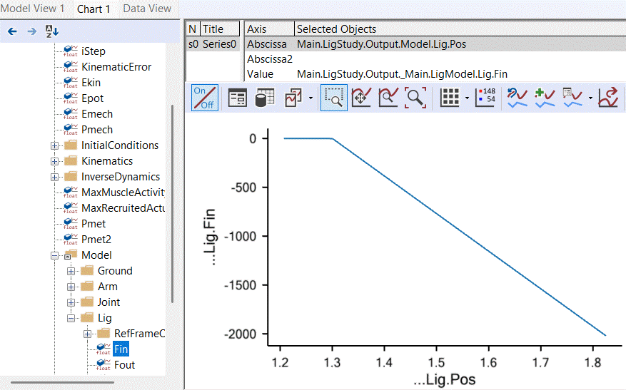
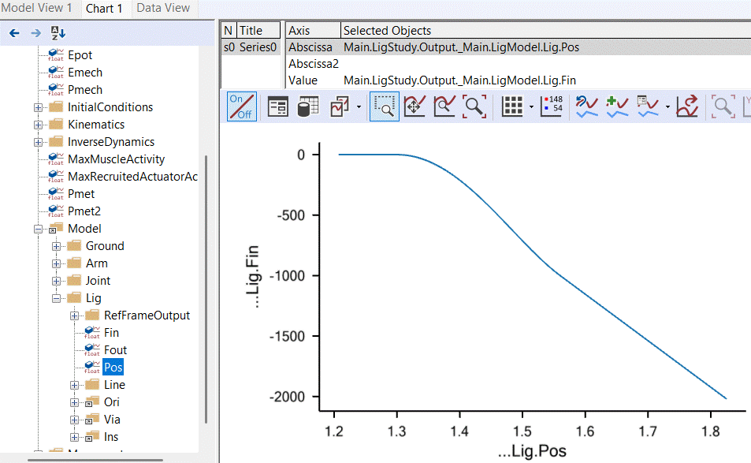
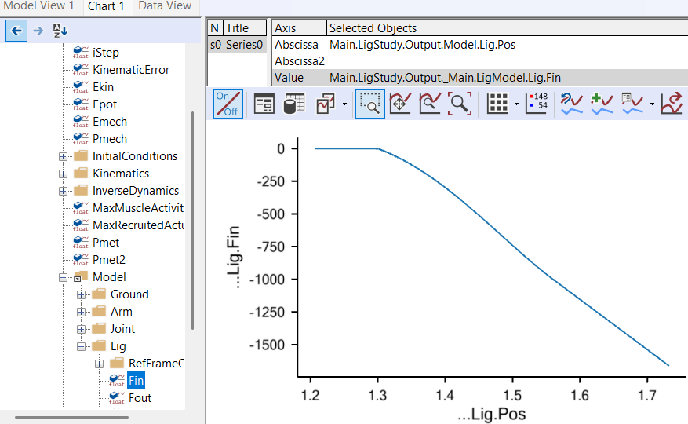
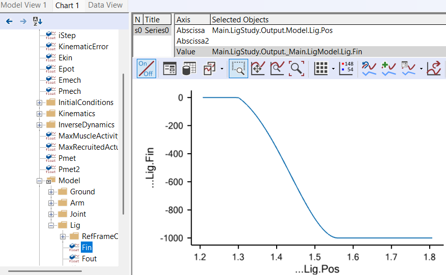
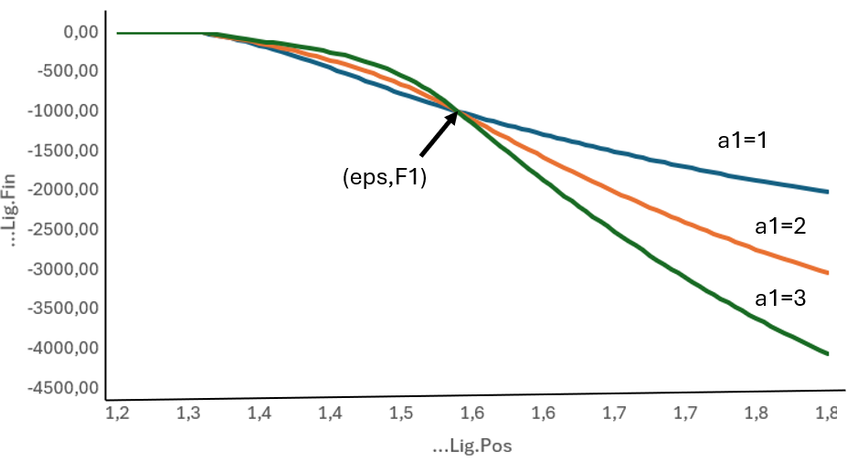
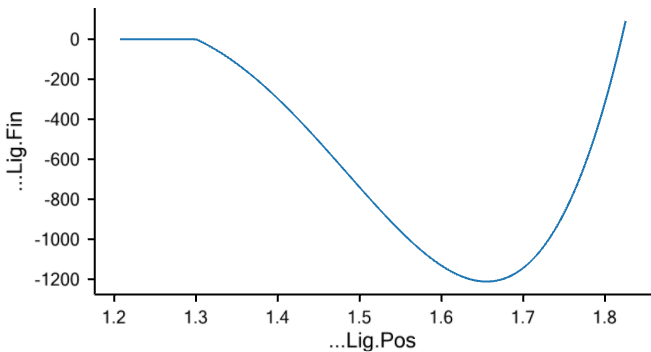
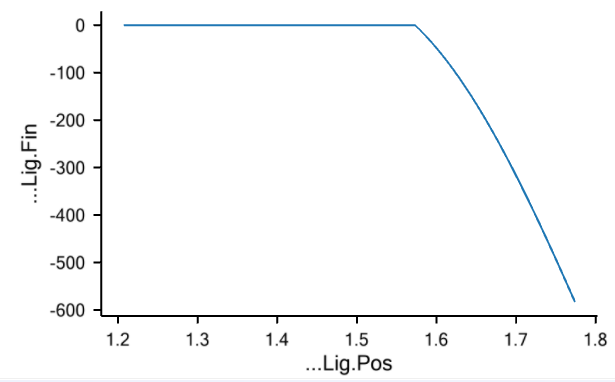

::: {rst-class} break
:::

# Lesson 7: Ligaments

Ligaments are passive structures that connect articulating bones and
keep joints assembled. Mechanically they are much like muscles but with
no active contractile element. Ligaments only provide forces when they
are stretched by the relative movement of the bones they connect.

This tutorial demonstrates how to define, control, and calibrate
ligaments. We need a model to work on. Please download and save the
model {download}`Demo.Ligament.any <Downloads/Demo.Ligament.any>`. Once you
have stored it on your hard disk, load it into the AnyBody Modeling
System and run the InitialConditions operation.


As you can see, the model is very simple. The blue structure is an "arm"
that extends from the center of the yellow Ground reference frame. It is
hinged at the Ground's origin, and a driver bends it downwards. With the
movement, the red ligament is stretched, and a force builds up in it.
Try running the InverseDynamics operation. You will see the arm
move, and you can subsequently open a Chart View to investigate the
results:


As you can see, the ligament force builds up from nothing to about -2000
N as it is stretched. The value is negative by convention because it
works in the opposite direction of the stretching. Notice that the graph
has an initial flat part. This is because force does not build up
until the ligament is stretched beyond its slack length, L0.

## Basic Mathematical Behavior

It looks like the force development is slightly nonlinear. This would
make sense because ligament elasticity is generally nonlinear, but in
this case it just shows that the abscissa is not the ligament length but
rather an artificial "time" that is proportional to the joint angle.

In the Chart View you can plot any output data against each other. Let's
select instead of time the ligament length. Click the "Out" button, and
the field containing the abscissa becomes white. You can now type
LigStudy.Output.Model.Lig.Pos" in the abscissa field:



That's better. Now the elasticity of the ligament is completely linear
over the slack length. Let us take a look at the definition of the
ligament model:

```AnyScriptDoc
AnyLigamentModelPol LigModel = {
L0 = 1.30; // Slack length
eps1 = 0.2; // Strain where F1 is valid
F1 = 1000; // Force in the ligament at strain eps1
};
```

As you can see, we have only defined three properties. L0 is the slack
length. The ligament is not stretched until its length goes beyond L0,
so its strain is zero at L0. When the ligament is stretched, it also
builds up a force. The rate of force development with stretching can be
thought of as the stiffness of the ligament, and it is defined as the
pair (eps1,F1), where F1 is the force in the ligament at strain eps1.
Why do we choose to work with strain here rather than absolute length
change? The reason is that ligaments are rather stiff structures, so
small length changes can cause large forces, and it is therefore
necessary that the slack length fits the model precisely. This length
will usually have to be tuned to size changes of the body model. When we
work with strain, the stiffness becomes a more generic property of the
ligament and is independent of the length it gets calibrated to.

The three parameters we have defined leave room for no more than a
linearly elastic behavior with a slack length. Ligament elasticity is
generally not linear, so we need something extra to be able to specify
nonlinear behavior. The mathematical background for the
AnyLigamentModelPol is that it takes the form:

$F = c_0 + c_1 \epsilon + c_2 \epsilon^2 + c_4 \epsilon^4$

As you can see, it is a fourth order polynomial with the third order
term missing. The 0'th order coefficient accounts for the slack length,
and the first order coefficient accounts for the slope when the model is
linear. In the
presence of the nonlinear terms it becomes very difficult to interpret
the significance of each term. For this reason, the nonlinearity in the
model is defined by two parameters with an easier interpretation than
the above-mentioned $c_2$ and $c_4$.

These two parameters are named a0 and a1, respectively. The first
parameter, a0, defines the slope of the curve at slack length. If you
study the curve above, you can see that it has a sharp kink at the slack
length. It changes abruptly from zero slope to the nominal slope given
by (eps1,F1). The default value of a0 is 1, and this corresponds to the
slope right after the kink being defined entirely by (eps1,F1). In other
words, the curve is pointing directly at the point (eps1,F1). In fact,
the significance of the a0 is that it interpolates the slope between
zero (for a0 = 0) and the linear slope you see in the curve above for a0
= 1. Try inserting the following:

```AnyScriptDoc
AnyLigamentModelPol LigModel = {
L0 = 1.30; // Slack length
eps1 = 0.2; // Strain where F1 is valid
F1 = 1000; // Force in the ligament at strain eps1
§a0 = 0.0;§
};
```

Subsequently reload the model, run InverseDynamics, and plot
the ligament force again. You will see the following:



The specification has created a continuous slope of 0 where the curve
previously had a kink. Notice that the curve converges back to the
"nominal" slope given by the two points (L0,0) and (eps1,F1)

If you try the following:

```AnyScriptDoc
AnyLigamentModelPol LigModel = {
L0 = 1.30; // Slack length
eps1 = 0.2; // Strain where F1 is valid
F1 = 1000; // Force in the ligament at strain eps1
a0 = 0.§5§;
};
```

then you get something in between, as the following curve:



The significance of a1 is much the same, except it has its effect at the
point (eps1,F1) rather than at (L0,0). If, for instance you insert

```AnyScriptDoc
AnyLigamentModelPol LigModel = {
L0 = 1.30; // Slack length
eps1 = 0.2; // Strain where F1 is valid
F1 = 1000; // Force in the ligament at strain eps1
a0 = 0.5;
§a1 = 0.0;§
};
```

then you will get a curve that attains zero slope at (eps1,F1):



So, a1 = 0.0 corresponds to zero slope, and the default value of a1 =
1.0 corresponds to the slope given by the values of L0, eps1, and F1.
You can similarly increase the slopes by increasing a1:



Unlike normal fourth order polynomials, these curves will continue
predictably with no oscillation for as long as desired after (eps1,F1).
The reason for this behavior is the default setting of the parameter

```AnyScriptDoc
LinRegionOnOff = On
```

which causes the curve to continue a linear behavior after (eps1,F1).
You can, however, obtain the clean fourth order polynomial behavior as
you like by switching this setting off:

```AnyScriptDoc
AnyLigamentModelPol LigModel = {
L0 = 1.30; // Slack length
eps1 = 0.2; // Strain where F1 is valid
F1 = 1000; // Force in the ligament at strain eps1
a0 = 0.5;
a1 = 1.0;
§LinRegionOnOff = Off;§
};
```



Clearly, this causes the curve to diverge after (eps1,F1), which is
typical for higher order polynomials. Unless you have some special reason
to prefer the pure fourth-order behavior, we recommend that you leave
LinRegionOnOff = On.

**Calibration**

Most ligaments in the body are rather stiff structures in which the
force builds up quickly when they are stretched beyond the slack length.
This means that a small error in slack length specification could lead
to a large error in computed ligament force. It therefore becomes
crucial that the ligaments fit the other parts of the model exactly.

The easiest way to determine ligament slack lengths is by means of joint
angles. For most joints where ligaments play an important role, it is
obvious in which position of the joint the ligament becomes taut.
Therefore, ligaments are calibrated just like muscles by positioning the
joints in question and letting the system automatically change L0 of
each ligament to the length in that position.

Lets try to calibrate our ligament. The first thing we must do is to
create a Calibration Study:

```AnyScriptDoc
§AnyBodyCalibrationStudy LigCali = {
AnyFolder &Model = .LigModel;
nStep = 1;

// This driver puts the joint into the calibration position
AnyKinEqSimpleDriver Position = {
DriverPos = {-pi/4};
DriverVel = {0.0};
AnyRevoluteJoint &Jnt = Main.LigModel.Joint;
};
};§
```

Notice the driver in the study. It positions the joint at the angle of
-pi/4. This becomes the position in which the ligament has its slack
length. Try loading the model and then browse your way through the tree
to the L0 property of the ligament model:


Double-click it, and its value is shown in the Object Description
window. You should find a value of

Main.LigModel.LigModel.L0 = 1.300000;

This is the slack length of the ligament at load time as defined in the
ligament model. Now, run the LigCali.LigamentLengthAdjustment operation,
and subsequently double-click the L0 property again. Now you will see a
value of

Main.LigModel.LigModel.L0 = 1.573132;

The system has extended the ligament length a bit to fit the joint angle
of -pi/4. Run the InverseDynamics study again, and see the
influence of the increased slack length:



You can find the final version of the ligament demo file
{download}`here <Downloads/Demo.Ligament.final.any>`.
